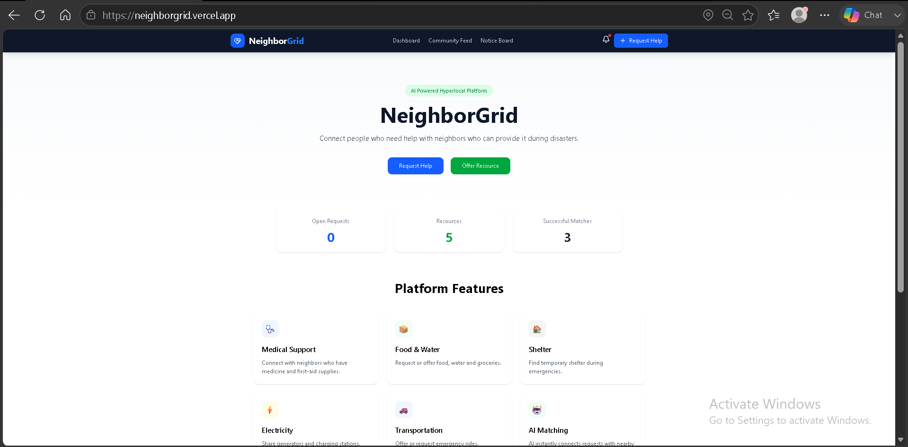
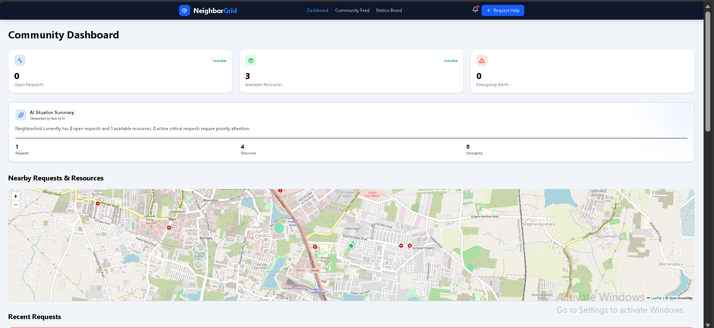
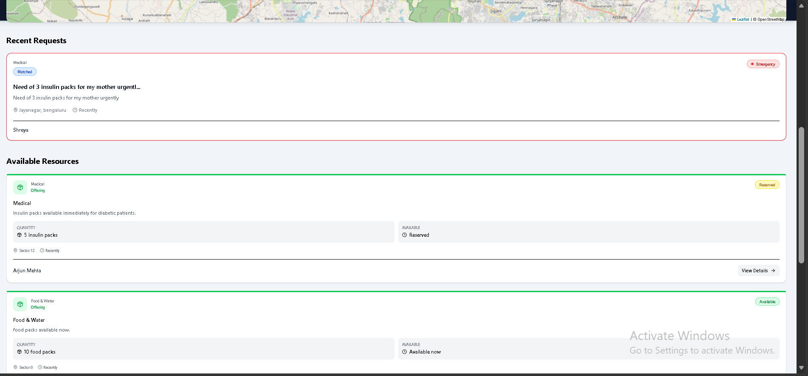
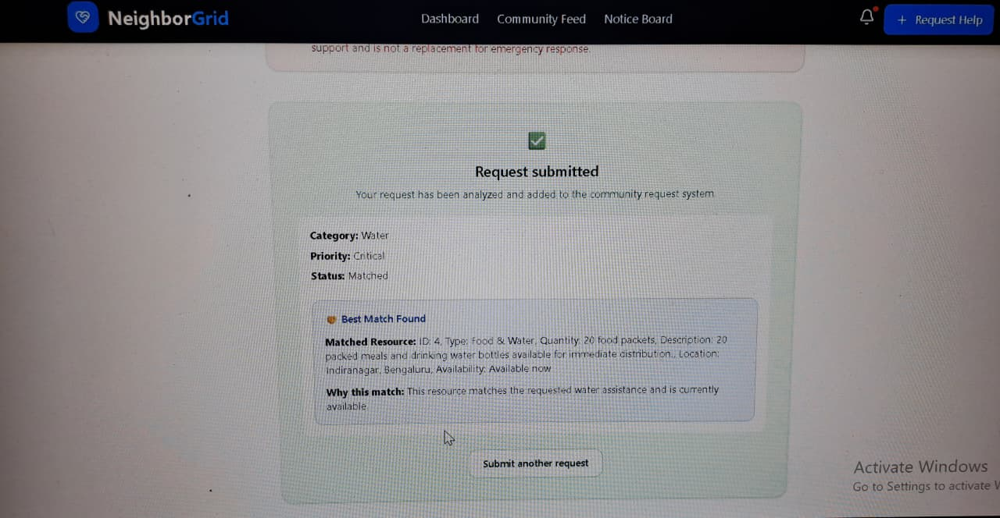
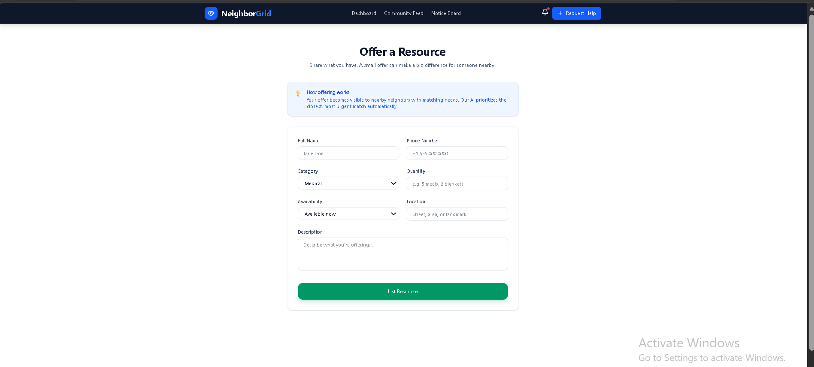
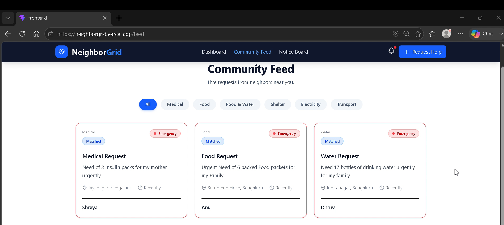

# 🏘️ NeighborGrid

### AI-Powered Hyperlocal Community Assistance Platform

NeighborGrid is an AI-powered hyperlocal community assistance platform developed for the **Build.IT Hackathon**.

The platform connects people who need urgent help with nearby community members who can offer resources. AI is used to classify assistance requests, detect urgency, and intelligently match requests with available community resources.

---

## 🌐 Live Application

**Frontend:**  
https://neighborgrid.vercel.app

**Backend API:**  
https://neighborgrid-backend.onrender.com

**API Documentation:**  
https://neighborgrid-backend.onrender.com/docs

> **Note:** The backend is hosted on Render's free instance, so the first request may take some time if the server has been inactive.

---

## 💡 Problem Statement

During emergencies and everyday situations, people may urgently need resources such as food, drinking water, medical supplies, shelter, electricity support, or transportation.

At the same time, nearby individuals may have these resources available but lack an efficient way to connect with people who need them.

**NeighborGrid provides a centralized AI-powered platform that intelligently connects community needs with available local resources.**

---

## ✨ Key Features

### 🤖 AI-Powered Request Classification
Analyzes help requests and automatically identifies the appropriate category, such as Medical, Food, Water, Shelter, Electricity, or Transport.

### 🚨 Intelligent Priority Detection
Analyzes the urgency of submitted requests and assigns priority levels, helping critical community needs receive attention quickly.

### 🤝 Smart Resource Matching
Compares user requests with available community resources and identifies the most suitable match based on the requested need and resource availability.

### 📦 Community Resource Offering
Allows community members to list available resources along with their quantity, availability, location, and description.

### 📊 Community Dashboard
Provides an overview of open requests, available resources, emergency alerts, and overall community activity.

### 🗺️ Interactive Community Map
Uses Leaflet and OpenStreetMap to visually represent nearby community requests and resources.

### 📰 Community Feed
Displays submitted requests with their category, priority, location, matching status, and other relevant information.

### 📢 Notice Board
Provides a dedicated space for community notices and important updates.

---

## 📸 Application Screenshots

### 🏠 Home Page



### 📊 Community Dashboard





### 🆘 AI-Powered Request Matching



### 📦 Offer a Resource



### 📰 Community Feed



---

## 🧠 AI Workflow

```text
User Submits Request
        ↓
AI Request Classification
        ↓
Priority Detection
        ↓
Request Stored in Database
        ↓
Resource Matching
        ↓
Best Match Recommendation
        ↓
Community Dashboard & Feed
```

---

## 🧩 Core Logic — Pseudocode

### Request Classification

**File:** `app/ai/services/classifier.py`

```text
FUNCTION classify_request(description):
    RECEIVE request description
    ANALYZE request
    IDENTIFY relevant category
    RETURN detected category
```

### Priority Detection

**File:** `app/ai/services/priority_detector.py`

```text
FUNCTION detect_priority(description):
    ANALYZE urgency indicators

    IF critical situation:
        RETURN critical
    ELSE IF urgent:
        RETURN high
    ELSE:
        RETURN normal
```

### Resource Matching

**File:** `app/ai/services/matcher.py`

```text
FUNCTION match_resources(request, resources):
    RETRIEVE available resources
    COMPARE request with resources
    IDENTIFY suitable resources
    SELECT best match
    RETURN matched resource
```

---

## 🛠️ Tech Stack

| Layer | Technologies |
|------|-------------|
| **Frontend** | React, Vite, JavaScript, Leaflet |
| **Backend** | Python, FastAPI, SQLAlchemy, Uvicorn |
| **Database** | SQLite |
| **AI** | Google Gemini API |
| **Maps** | Leaflet, OpenStreetMap |
| **Deployment** | Vercel, Render |
| **Version Control** | Git, GitHub |

---

## 🏗️ System Architecture

```text
                 User
                   │
                   ▼
          React + Vite Frontend
                   │
              REST API
                   │
                   ▼
            FastAPI Backend
              │         │
              ▼         ▼
        AI Services   SQLite
              │
     ┌────────┼────────┐
     ▼        ▼        ▼
 Classifier Priority Matcher
```

---

## 📂 Project Structure

```text
Build.IT-Hackathon/
│
├── backend/
│   ├── app/
│   │   └── ai/
│   │       └── services/
│   │           ├── classifier.py
│   │           ├── priority_detector.py
│   │           └── matcher.py
│   ├── main.py
│   ├── database.py
│   ├── models.py
│   ├── schemas.py
│   ├── crud.py
│   └── requirements.txt
│
├── frontend/
│   ├── public/
│   ├── src/
│   │   ├── components/
│   │   ├── pages/
│   │   ├── App.jsx
│   │   └── main.jsx
│   ├── package.json
│   └── vite.config.js
│
├── screenshots/
│   ├── home.png
│   ├── dashboard.png
│   ├── ai-matching.png
│   ├── offer-resource.png
│   └── community-feed.png
│
└── README.md
```

---

## 🔌 API Endpoints

| Method | Endpoint | Description |
|--------|----------|-------------|
| `GET` | `/` | Backend home endpoint |
| `GET` | `/requests` | Get all requests |
| `POST` | `/requests` | Create a help request |
| `GET` | `/requests/pending` | Get pending requests |
| `PATCH` | `/requests/{request_id}` | Update request status |
| `GET` | `/resources` | Get all resources |
| `POST` | `/resources` | Add a resource |
| `GET` | `/resources/available` | Get available resources |
| `GET` | `/ai-test` | Test AI functionality |
| `GET` | `/match/{request_id}` | Match request with resources |

---

## 💻 Run Locally

### Clone the Repository

```bash
git clone https://github.com/p-deepikaaa/Build.IT-Hackathon.git
cd Build.IT-Hackathon
```

### Backend

```bash
cd backend
python -m venv .venv
.venv\Scripts\activate
pip install -r requirements.txt
uvicorn main:app --reload
```

Backend runs at `http://127.0.0.1:8000`.

### Frontend

```bash
cd frontend
npm install
npm run dev
```

Frontend typically runs at `http://localhost:5173`.

---

## 🚀 Deployment

The **React + Vite frontend** is deployed on Vercel, while the **FastAPI backend** is deployed separately on Render.

The frontend communicates with the deployed REST API to manage requests, resources, and AI-powered matching.

---

## 🌍 Vision

NeighborGrid demonstrates how AI can help create stronger hyperlocal support networks by connecting **people who need help** with **people who are ready to help**.

The platform can support communities during emergencies and everyday situations by making local resource coordination faster and smarter.

---

## 🏆 Build.IT Hackathon

Developed as part of the **Build.IT Hackathon**, NeighborGrid uses AI and modern web technologies to address the real-world challenge of coordinating community assistance and resources.

---

## 📄 License

This project was developed for educational and hackathon purposes.

---

⭐ **If you found NeighborGrid interesting, consider starring the repository!**
